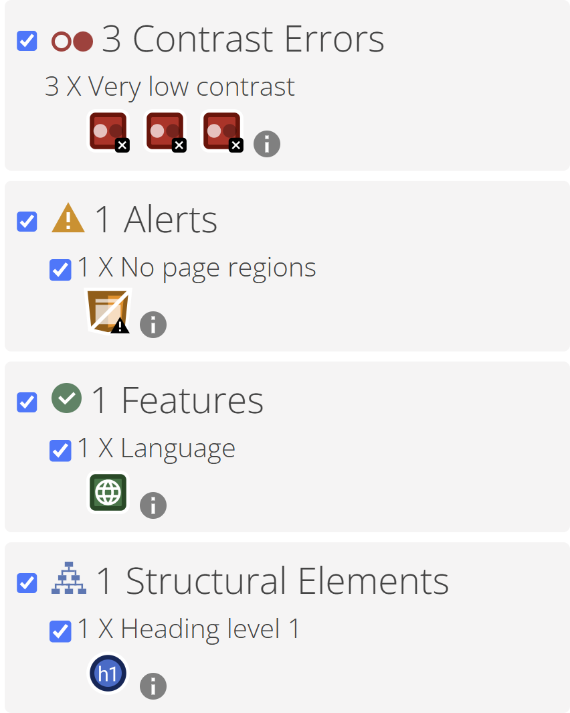
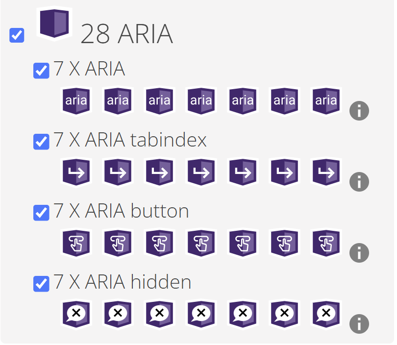
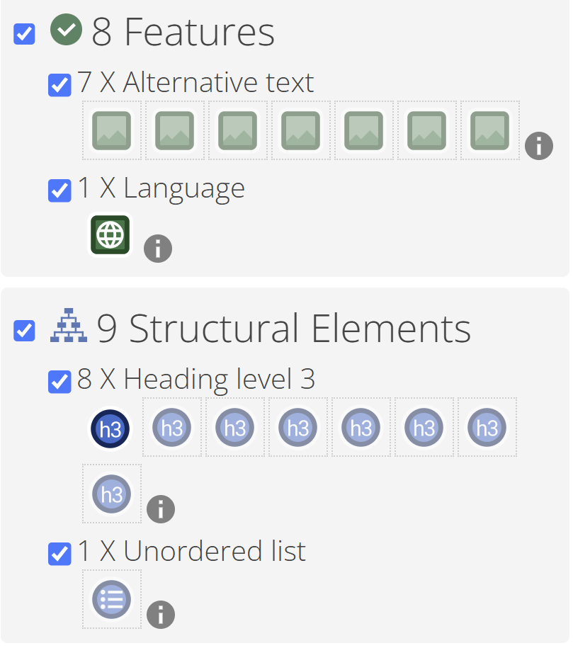
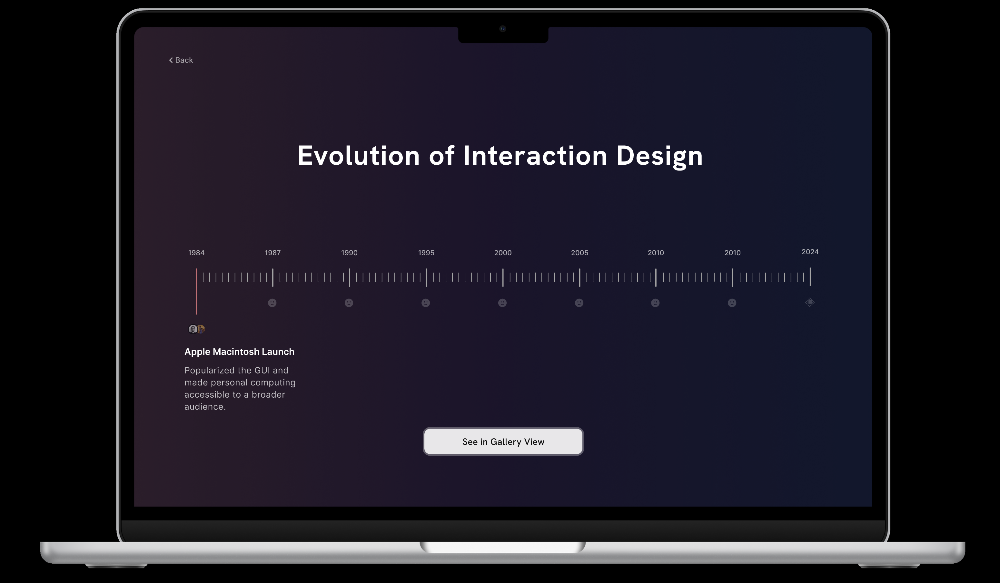
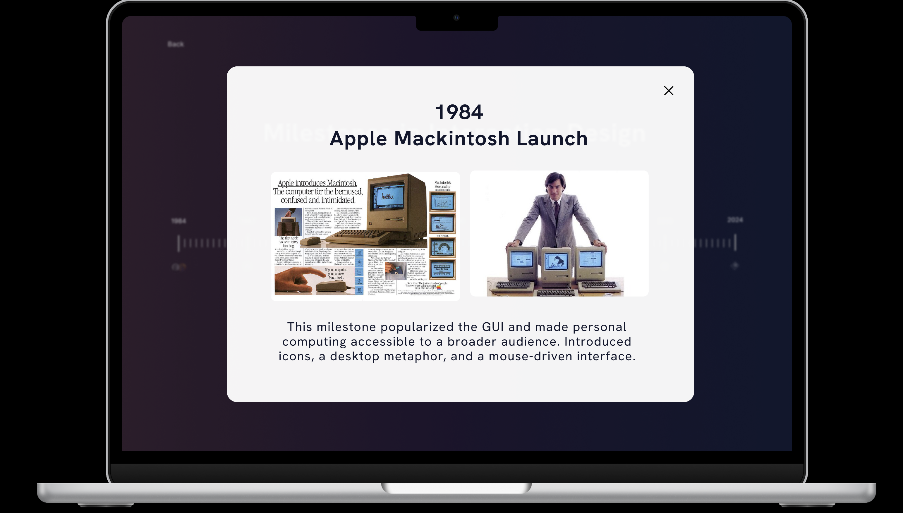
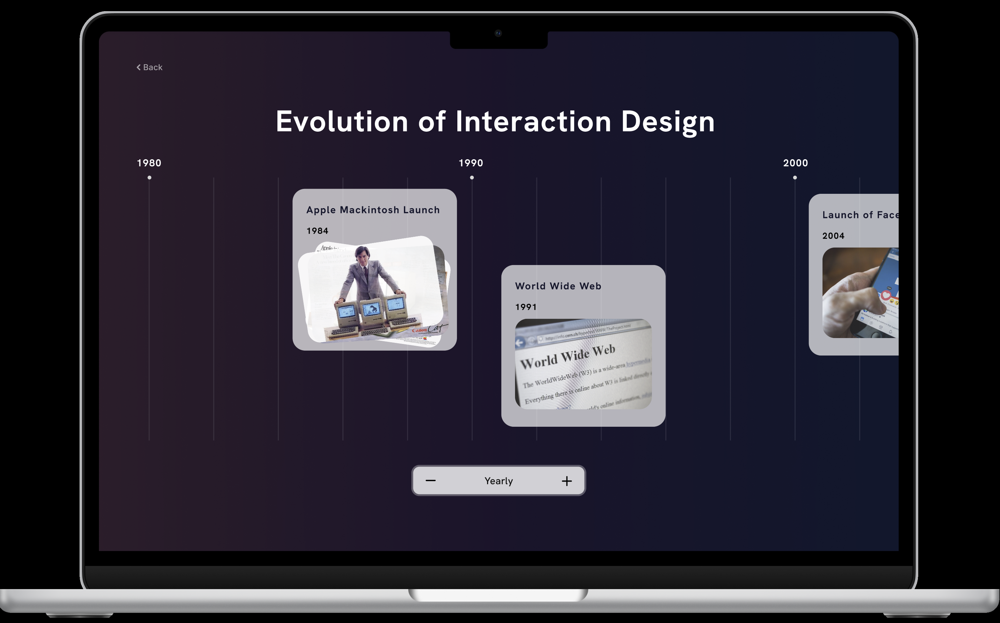
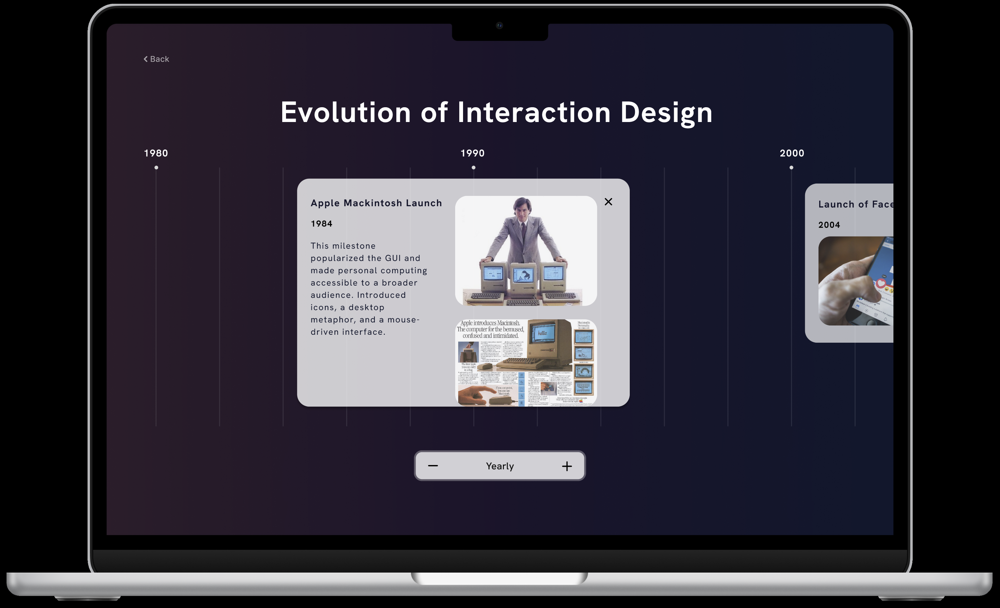
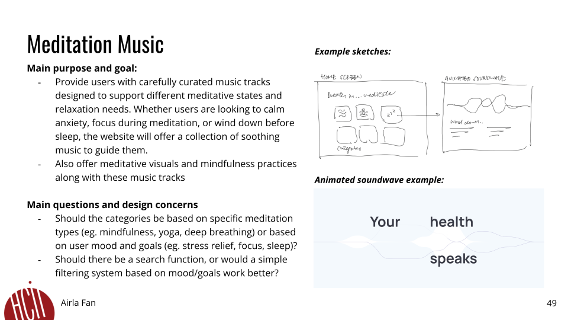
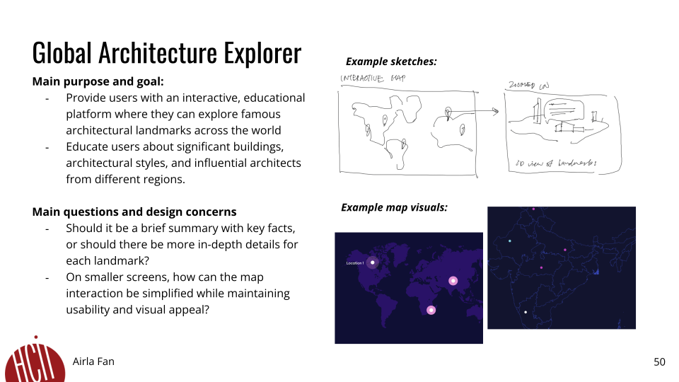

<mark>**Note that this document order from FP4 -> FP1**</mark>

<mark>Please sign up for the study</mark> at [https://tinyurl.com/pui-study](https://tinyurl.com/pui-study) to allow us to use your submission to create a better GenAI assistant for designers!

---

# **FP4 \- Final Project Writeup**

Feel free to refer to this [Markdown Cheat Sheet](https://www.markdownguide.org/cheat-sheet/) to make your writeup more organized, and you can preview your markdown file in VSCode [Markdown editing with Visual Studio Code](https://code.visualstudio.com/docs/languages/markdown#_markdown-preview). 

## Part 1: Website Description

Describe your website (300 words).

* What is the purpose of your website?   
The website is designed as an interaction design time capsule that chronicles the birth and evolution of the field over the past four decades. Its purpose is to fill a notable gap in documenting the history of interaction design, a relatively young and ever-evolving discipline. By providing an accessible resource, the site encourages designers to reflect on and learn from the rich history of the field, using it to inform future innovation rather than focusing solely on the new.

* Who is the target audience?  
The website primarily targets interaction designers seeking to deepen their understanding of the discipline's roots and evolution. Additionally, it is crafted to engage those who are new to the field, offering an approachable way to explore its history. Whether you're a seasoned professional, a student, or simply curious, the website aims to captivate and educate a diverse audience.

* What information do you convey with your website? 
The website conveys a detailed timeline of interaction design’s development, highlighting pivotal moments, influential projects, and groundbreaking theories that have shaped the discipline. Each milestone is enriched with contextual information, including images, and narratives, making the content both informative and immersive.  

* How is it interesting and engaging? 
What sets the website apart is its interactivity. Users can explore the timeline in multiple ways, such as hovering over key points, tapping on specific milestones, or navigating using their keyboard. This flexible interface makes the experience playful and inclusive, accommodating different user preferences. By offering a hands-on way to engage with history, the site transforms exploration into an enjoyable activity, ensuring that users not only learn but also have fun as they navigate this unique time capsule.

## Part 2: User Interaction

How a user would interact with your website? For each step, briefly but clearly state the interaction type & how we should reproduce it.

1. Read the homepage description and click on "Begin your journey" (Click)
2. Read the panel on the top on how to navigate the timeline (Read)
3. Use the mousepad to swipe to the right/left of the screen, noticing how the timeline progresses with you (Scroll/Swipe)
4. Hover over a node on the timeline to trigger it to expand (Hover)
5. Click on the expanded node to access the pop up with more detailed information on the specific milestone (Click)
6. Click on the pop up again to close it (Click)

Alternative timeline navigation:
1. Press the right/left arrows on the keyboard to navigate the timeline (Key press)
2. Once you arrive at the desired milestone, press the space bar to access the pop up (Key press)
3. Press the space bar again to close the pop up (Key press)

## Part 3: External Tool

Describe what important external tool you used (JavaScript library, Web API, animations, or other). Following the bulleted list format below, reply to each of the prompts.

1. Web APIs
   * Why did you choose to use it over other alternatives? 
      * I used the Web APIs provided by JavaScript because they are lightweight, natively supported in browsers, and eliminate the need for external libraries for simple DOM manipulation and event handling. This keeps the project efficient and free of unnecessary dependencies.
   * How you used it? (2 sentences max)  
      * I used the document API to query and manipulate DOM elements, adding event listeners for interactivity, such as handling mouse movements, clicks, and keyboard navigation. Additionally, I leveraged scrollIntoView, querySelector, and getBoundingClientRect for dynamic timeline navigation and positioning.
   * What does it add to your website? (2 sentences max)  
      * It enables seamless interactivity and accessibility, allowing users to navigate the timeline, display pop-ups, and interact with hover effects dynamically. This results in a smoother user experience and intuitive interface behavior.
2. CSS Animations (keyframes)
   * Why did you choose to use it over other alternatives? 
      * CSS animations are simple to implement, have minimal performance overhead, and allow smooth transitions without requiring JavaScript libraries like GSAP. They integrate natively with the styling of the webpage, ensuring consistent animations.
   * How you used it? (2 sentences max)  
      * I implemented keyframe animations like fadeIn to create smooth fade-ins for the text, buttons, and interactive elements. This was combined with transition effects for hover states and gradient updates to enhance the visual feedback.
   * What does it add to your website? (2 sentences max)  
      * The animations add a polished look and make the interactions feel more dynamic and engaging. This enhances user immersion and guides them through the website's interactive timeline effectively.

## Part 4: Design Iteration

Describe how you iterated on your prototypes, if at all, including any changes you made to your original design while you were implementing your website and the rationale for the changes. (4-8 sentences max)

Throughout my project, I iterated extensively on how to display the milestones on the timeline to balance functionality, clarity, and accessibility. Initially, I designed a more complex timeline where users hovered over lines to access pop-ups, but this proved unintuitive. I then explored a "card" style for each milestone, where users could click to reveal detailed information. Ultimately, I simplified the timeline further to ensure users of all levels could navigate comfortably. The current version condenses the pop-ups into modular elements tied to each milestone, rather than taking over the entire screen, creating a more focused and seamless interaction. I also added a progress bar to provide users with a clear sense of location within the timeline and included a detailed navigation guide at the top for clarity. These changes were informed by accessibility considerations, adhering to WAVE guidelines to ensure inclusivity and usability for a diverse audience. The iterative process allowed me to refine the design, making it intuitive, accessible, and engaging for all users.

## Part 5: Implementation Challenge

What challenges did you experience in implementing your website? (2-4 sentences max)

I faced challenges in implementing both mousepad and keyboard interactions within the timeline to ensure seamless usability for all users. Balancing these interaction methods while keeping the navigation intuitive required careful planning and testing. Styling the timeline was another hurdle, as I needed to simplify the content delivery without losing its depth or accessibility. Iterating on the design helped me strike a balance between functionality, clarity, and user-friendliness.

## Part 6: Generative AI Use and Reflection

Describe how you used Generative AI tools to create this final project (fill in the following information, write \~500 words in total).

Document your use of all GenAI tools — ChatGPT, Copilot, Claude, Cursor, etc. using the template below. Add/Delete rows or bullet points if needed, and replace Tool1/Tool2 with the name of the tool.

### Usage Experiences by Project Aspects

Feel free to edit the column \_ (other?) or add more columns if there's any other aspect in your project you've used the GenAI tools for.

For the following aspects of your project, edit the corresponding table cell to answer:
- *Usage*: Whether you used / did not use this tool for the aspect. Enter [Yes/No]
- *Productivity*: Give a rating on whether this tool makes your productivity for X aspect [1-Much Reduced, 2-Reduced, 3-Slightly Reduced, 4-Not Reduced nor Improved, 5-Slightly Improved, 6-Improved, 7-Much Improved].

| Tool Name | Ratings | design | plan | write code | debug | Accessibility |
| :---- | :---- | :---- | :---- | :---- | :---- | :---- |
| ChatGPT | Usage | Yes | Yes | Yes | Yes | Yes |
| ChatGPT | Productivity | 7 | 6 | 7 | 6 | 6 |
| V0 | Usage | Yes/No | Yes/No | Yes/No | Yes/No | Yes/No |
| V0 | Productivity | 4 | 2 | 3 | 3 | 4 |

### Usage Reflection

> Impact on your design and plan 
* It matched my expectations and plan in [FP2](#generative-ai-use-plan) in that … For example, 
  1. ChatGPT: I used ChatGPT extensively to troubleshoot specific issues, such as implementing keyboard interactions for my timeline feature and resolving WAVE accessibility issues. It aligned well with my needs for debugging and cleaning up code, making the process more efficient and manageable.
  2. V0: This tool provided UI design suggestions, such as gradients and animations. While its responses were sometimes helpful conceptually, it often generated unusable or error-prone code.

* It did not match my expectations and plan in [FP2](#generative-ai-use-plan) in that … For example, 
  1. ChatGPT: While reliable for technical and debugging tasks, it occasionally provided overly complex solutions that needed simplification to fit the project. 
  2. V0: The tool failed to meet expectations as it often produced code that was either error filled or incompatible with the rest of my project.
  
* GenAI tool did/did not influence my final design and implementation plan because … For example, 
  1. ChatGPT: Significantly influenced my final implementation by helping structure clean, accessible code and enabling me to add polished animations through CSS keyframes.
  2. V0: Had limited influence on the final design due to the high error rate and lack of reliability in its suggestions.

> Use patterns
* I accepted the generations when …  For example, 
  1. ChatGPT: Suggested practical fixes, such as structuring my code for accessibility and resolving contrast issues flagged by WAVE. For example, I implemented its recommendation to use aria labels to improve screen reader compatibility because it was clear and effective.
  2. V0: Occasionally suggested visually appealing gradient concepts, such as a radial gradient effect for the background, which I adapted manually after testing and refining the output.
 
* I critiqued/evaluated the generated suggestions by … For example, 
  1. ChatGPT: Carefully testing the provided code in the browser and ensuring it aligned with WAVE's accessibility standards. For example, when it generated a solution for keyboard navigation, I adjusted the logic to match my existing structure better.
  2. V0: Reviewed its animation code in the browser, but often rejected it when errors arose or it clashed with other styles. I ultimately relied on ChatGPT to generate simpler and more effective animation solutions.

> Pros and cons of using GenAI tools
* Pros
  1. ChatGPT:
    * Provided reliable, accessible solutions to complex coding problems.
    * Enhanced productivity by speeding up debugging and implementation tasks.
    * Helped structure code for readability and maintainability.
  2. V0:
    * Offered creative UI ideas, such as animation effects and gradient designs, that inspired parts of my visual implementation.
* Cons
  1. ChatGPT:
    * Occasionally provided overly complex or verbose solutions that required significant adaptation.
    * Limited in suggesting creative visual design elements.
  2. V0:
    * Generated error-prone or incompatible code for animations and UI designs.
    * Often lacked sufficient testing or context-awareness, leading to wasted time debugging its suggestions.

### Usage Log

Document the usage logs (prompts and chat history links) for the GenAI tools you used. Some tools may not have an easy way to share usage logs, just try your best! Some instructions for different tools:

1. [ChatGPT](https://help.openai.com/en/articles/7925741-chatgpt-shared-links-faq) / [Gemini](https://support.google.com/gemini/answer/13743730?hl=en&co=GENIE.Platform%3DDesktop): share the anonymous link to all of your chat histories relevant to this project
* https://chatgpt.com/share/6757bc49-bfe8-8003-b13e-6f34f7a11130
* https://chatgpt.com/share/6757bcd1-e548-8003-9a2c-75c33cced9a8
2. [GitHub Copilot (VSCode)](https://code.visualstudio.com/docs/copilot/copilot-chat#:~:text=You%20can%20export%20all%20prompts%20and%20responses%20for%20a%20chat%20session%20in%20a%20JSON%20file%20with%20the%20Chat%3A%20Export%20Session...%20command%20(workbench.action.chat.export)%20in%20the%20Command%20Palette.): export chat histories relevant to this project.

## Part 7: Responsiveness and Accessibility (added in as per project requirements)

* Responsiveness:
  * The website is designed with responsiveness in mind, ensuring an optimal experience across various screen sizes. On desktop and tablet devices, the layout provides ample space for the timeline and accompanying content, making it the most suitable format for exploring milestones interactively.
  * For smaller screens, such as mobile devices, the timeline condenses intelligently. The text size and spacing adjust dynamically to maintain readability without overwhelming the user. Pop-ups for milestones scale proportionally, ensuring all information remains accessible and visible without unnecessary scrolling. 

* Accessibility:
  * Using WAVE to evaluate my site's accessibility, I identified several areas for improvement, including adding ARIA labels and better structural elements to enhance navigation and screen reader compatibility. One persistent challenge was addressing "contrast color" errors flagged by the tool. To tackle this, I adjusted the color palette, increasing the contrast by using white text against a deep blue (almost black) background. While these changes improved readability, the errors still persisted in some areas.
  * If I had more time, I would explore implementing additional solutions, such as offering a light mode toggle. This feature would allow users with specific visibility needs to switch to a high-contrast light mode, ensuring an inclusive experience for all users. Understanding the nuances of contrast standards and experimenting with dynamic theme options would be key next steps to fully resolve this issue.

  ### *Screenshots from WAVE test*
  
  
  
---

# **FP3 \- Final Project Check-in**

Document the changes and progress of your project. How have you followed or changed your implementation & GenAI use plan and why? Remember to commit your code to save your progress.

## Implementation Plan Updates

- [ ] Add keyboard interactions to ensure seamless navigation for users who rely on non-mouse inputs, such as arrow key navigation and space bar activation for pop-ups.
- [ ] Incorporate animations for transitions between timeline milestones to enhance user engagement and provide a smoother browsing experience.
- [ ] Refine the formatting of the timeline to improve its visual clarity and accessibility, ensuring all text and elements are properly aligned and consistently styled.
- [ ] Test and debug the newly added interactions and animations to ensure functionality across different browsers and devices.

## Generative AI Use Plan Updates

- [ ] Utilize AI-assisted debugging tools to address coding challenges related to animations and keyboard interactions.
- [ ] Generate accessible, user-friendly copy for timeline instructions and milestone descriptions to ensure clarity and consistency.

Remember to keep track of your prompts and usage for [FP4 writeup](#part-6-generative-ai-use-and-reflection).

---

# **FP2 \- Evaluation of the Final project**

## Project Description

For my final project, I am building a time capsule that captures the history of interaction design. Using an interactive and dynamic timeline, users can navigate through different moments in time and discover the evolution of this field. 

## High-Fi Prototypes

### *Prototype 1*

This first mockup shown here showcases the overall timeline. When users hover over a specific time period, the timeline marker expands to reveal additional details about the selected era. For example, "Apple Macintosh Launch" is used here as a placeholder to illustrate how events will populate the timeline.

### *Prototype 2*

This second mockup shows the pop-up that will appear when the user selects a specific time period. The pop-up consists of imagery and more specific information on the milestone selected. The user can scroll down to learn more or exit the pop-up by selecting the cross icon in the top right corner.

## Usability Test

For usability testing, I developed a script to encourage participants to think aloud when navigating through my initial prototype. The questions and prompts I crafted focused on seeing if users can intuitively navigate the timeline, access pop-up information on key milestones, and understand the site’s layout and interactive elements.

* Landing Page Exploration:
  - Prompt: “You’re on the landing page with the prompt ‘Begin Your Journey.’ What would you do next?”
  - Follow-up: If they don’t click, prompt them to try it, and observe their response.

* Timeline Navigation:
  - Prompt: “Now that you’re on the timeline page, take a few moments to explore. What stands out to you here?”
  - Follow-up: “Click on any time period and try to access information on specific milestones.”

* Pop-Up Information Retrieval:
  - Prompt: "Once you’ve clicked on a milestone, please take a look at the pop-up. Is it easy to find the information you’re looking for?”
  - Follow-up: “Navigate to another milestone and open its pop-up. Share your experience.”

* Timeline Interaction Feedback:
  - Prompt: “While exploring the timeline, did you find it easy to identify clickable milestones?”
  - Follow-up: “Move along the timeline and hover over different moments. How does this experience feel? Is it clear where you can click?”

* Insights I gained:
  1. Intuitive use: Users liked the interactivity of the timeline but found it difficult to differentiate between the hover and clicking states - they didn’t know that clicking on a specific moment in the timeline would trigger a pop-up
  2. Navigation cues: One user didn’t really understand what “begin your journey” meant, leading to confusion immediately on the homepage
  3. Accessibility: Apart from clicking on the timeline, the user didn’t have any other methods of interacting with the timeline, making it inaccessible for many people

* Changes I plan to make:
  1. Making the pop-up activation more prominent, possibly with a tooltip or slight animation, could help users understand how to access these
  2. Making the timeline larger, allowing users to navigate through it easier and potentially customize further
  3. Could implement the keyboard, so users could navigate through the timeline by clicking on the arrow keys

## Updated Designs

### *Updated Prototype 1*

In the first updated prototype mockup, I enlarged the timeline significantly to make navigation more intuitive and accessible. When users hover over a milestone card, it transforms into a stack of cards, signaling that there is more content to explore. At the bottom, users now have the option to customize the timeline view by year or by decade, enhancing both visual engagement and interactivity. Additionally, users can navigate the timeline horizontally by pressing the left and right arrow keys, providing a more accessible scrolling experience.

### *Updated Prototype 2*

In the second updated prototype, the pop-up design has been refined to enhance usability. Rather than occupying the entire screen, the pop-up now covers only a portion beyond the initial milestone card, allowing users to easily see the timeline in the background. This layout signals to users that they can quickly exit the pop-up and continue exploring the timeline without losing their current place.

## Feedback Summary

In lab, the main feedback focused on making the timeline more accessible and improving the clarity of interactions. Students mentioned that they found it hard to tell which milestones were clickable, which made navigating the timeline confusing. This highlighted the need for more obvious visual cues to help users understand where to interact and know what to expect when they hover or click. This insight was valuable since it directly impacts how easily users can engage with the content.

Another piece of feedback was about accessibility, specifically making the timeline easier to browse. Some students felt that navigating through milestones could be smoother and more intuitive. They suggested customizing the timeline view to allow browsing by year or by decade, which would let users explore at their own pace based on how they want to view historical information. This option would also reduce any overwhelming feeling that might come from scrolling through too much content at once, keeping the experience more user-friendly and adaptable to different browsing preferences.

Additionally, a student suggested adding a light/dark mode toggle. This would give users control over the visual experience and help those who might be viewing the timeline in varied lighting conditions. Light/dark mode options could also make the experience more comfortable for users who may spend longer periods exploring, as it allows them to adjust the display based on their personal preferences or accessibility needs, like reducing eye strain.

Overall, the feedback I got in lab emphasized making interactions clearer and providing flexibility in the viewing experience. I think my updated prototypes address most of these concerns by introducing improved interactions and timeline customization. However, more attention could be paid to enhancing accessibility options, like the light/dark mode, to increase comfort and usability for all users.

## Milestones

Outline weekly milestones to plan your expected implementation progress until the end of the semester.

### *Implementation Plan*

- [ ] Week 9 Oct 28 \- Nov 1:
  - [X] FP1 due
  
- [ ] Week 10 Nov 4 \- Nov 8:   
  - [X] FP2 due
  - [ ] Keep iterating and finalizing prototype designs
  - [ ] Set up project and install necessary dependencies (libaries)

- [ ] Week 11 Nov 11 \- Nov 15:  
  - [ ] Build out core structure including the landing page and basic static timeline
  - [ ] Set up a horizontal layout for the timeline with simple milestone placeholders

- [ ] Week 12 Nov 18 \- Nov 22:   
  - [ ] Begin implementing GSAP or SwiperJS for smooth timeline scrolling
  - [ ] Use GSAP or Framer Motion to create the stacking effect for milestone hover states
  - [ ] Add click functionality to open pop-ups when users interact with milestones

- [ ] Week 13 Nov 25 \- Nov 29:  
  - [ ] Thanksgiving  
  - [ ] Design the pop-up to display milestone information without covering the entire screen
  - [ ] Implement closing functionality so users can easily exit the pop-up

- [ ] Week 14 Dec 2 \- Dec 6:  
  - [ ] Enable left/right keyboard navigation on the timeline for accessibility
  - [ ] Refine all animations, ensuring they’re smooth and unobtrusive
  - [ ] FP4 due 

### *Libraries and Other Components*

List the JS libraries and other components (if applicable) that you plan to use. 
* GSAP (GreenSock Animation Platform) - for creating visually engaging interactions
* KeyboardJS -  Enable keyboard navigation on the timeline

## Generative AI Use Plan

In implementing my interaction design time capsule site, I plan to use Gen AI tools like ChatGPT and GitHub Copilot thoughtfully to aid in code structuring, troubleshooting, and refining the user experience. Since this is an important personal journey, my goal is to use these tools responsibly, ensuring that they support my learning without replacing critical problem-solving steps.

Gen AI can help me efficiently set up and implement code libraries. For instance, ChatGPT and Copilot can assist in integrating complex libraries like GSAP and SwiperJS by generating foundational code snippets and providing clear examples of how to initialize and control animations. When I need to structure more complex features, such as the hover and click effects on milestones, Gen AI can suggest ways to organize my code effectively. I expect it to guide me through structuring components and managing states, which can be particularly helpful for maintaining the clarity and modularity of the code.

I expect that Gen AI will also be useful for troubleshooting. By identifying common errors or optimization strategies, ChatGPT can save me time in resolving issues that might otherwise slow down progress. For instance, if I encounter bugs in timeline navigation or issues with timeline accessibility, ChatGPT can often suggest alternative methods or help me refine my code.

However, I recognize that Gen AI might not always be suited to project-specific logic or highly detailed UI nuances. Certain interactions, like fine-tuning animations for smoothness or customizing the light/dark mode toggle, may require manual adjustments beyond what AI can offer. Additionally, since Gen AI cannot perform real-time testing, I’ll still need to rely on personal testing and feedback from usability testing to ensure the user experience is polished and accessible. By balancing AI’s support with hands-on coding and testing, I hope to use these tools as a responsible aid to my learning.

### *Tool Use*

 What would you use? Edit the list given your plan. For each tool, explain briefly on what do you expect Generative AI to help you with and what might it not be able to help you with.

* ChatGPT  
  * I’ll use ChatGPT for help with structuring components and explaining how to integrate specific libraries (like GSAP for animations or SwiperJS for scrolling)
  * Help craft engaging copy for each milestone, page descriptions 
* GitHub Copilot  
  * I might use it to get suggestions for alternative ways to structure code, such as optimizing timeline navigation or refactoring animations, making the codebase cleaner and potentially more efficient.

### *Responsible Use*

One way I’ll ensure responsible use is by treating AI suggestions as starting points rather than final answers. When Generative AI provides code snippets or troubleshooting advice, I plan to review, test, and adapt the suggestions rather than implementing them blindly. For example, if ChatGPT suggests a way to structure my timeline interactions, I’ll evaluate the logic, understand the approach, and make modifications to tailor it to my project’s specific needs. This way, I’m actively involved in every aspect of the code, ensuring I understand why certain choices are made.

Additionally, I’ll use Generative AI as a learning aid, not just a solution generator. By asking it for explanations on unfamiliar libraries or techniques, I can use AI as a tutor to fill in knowledge gaps. For instance, if I’m uncertain about implementing GSAP animations or optimizing accessibility, I’ll seek clarifications from ChatGPT to deepen my understanding of these elements, allowing me to apply this knowledge more independently in future projects. 

---

# **FP1 \- Proposal for Critique**

## Idea Sketches

### *Idea 1*

Add a few sentences about your design. Briefly state the motivation of each project idea. Example questions to answer:

* What is the basic idea of your final project? (1-2 sentences)  
  The Design Time Capsule is essentially an educational tool for beginners to learn about the history of interaction design in depth through an interactive timeline. Within the timeline, users can interact with different parts of it to unveil pivotal moments in design history and understand how it has evolved over time.

* How do you plan to make your design interactive and engaging?  
  - Clickable points that reveal a pop-up window with images and contexts for each design period
  - Animated transitions for more intuitive and enjoyable navigation of the timeline
  - Reflection prompts at the end of each design period/moment will encourage users to reflect on what they've learned

* How do you plan to make your design accessible?  
  - All multimedia elements, such as videos and images, will include subtitles and descriptive alt text for users who rely on text descriptions.
  - All interactive elements will be compatible with screen readers, with clear, descriptive labels for each element to ensure visually impaired users can navigate the timeline.
  - Users will be able to navigate the timeline through keyboard shortcuts, making it possible to explore the site without a mouse.

* What information do you specifically want to convey and include on your website?
  - Key events like the advent of the graphical user interface (GUI), the development of touchscreen technology, and the shift to mobile-first design will be emphasized.
  - Designers, researchers, and thought leaders who have left a significant mark on interaction design—such as Don Norman, Bill Moggridge, and Alan Cooper—will be highlighted, with brief biographies and summaries of their contributions.

### *Idea 2*

Add a few sentences about your design. Briefly state the motivation of each project idea. Example questions to answer:

* What is the basic idea of your final project? (1-2 sentences)  
  Meditation Music will provide users with carefully curated music tracks designed to support different meditative states and relaxation needs. Whether users are looking to calm anxiety, focus during meditation, or wind down before sleep, the website will offer a collection of soothing music to guide them.

* How do you plan to make your design interactive and engaging?  
  - The home page will feature intuitive icons and categories representing different relaxation needs so users can easily select their desired mood to access music that aligns with their state of mind.
  - Hovering over a playlist will trigger a brief, low-volume preview of the music style before actually selecting it
  - Meditative visuals will be provided in the background to further engage users in their current state

* How do you plan to make your design accessible?  
  - Users with auditory sensitivities can adjust volume and tone settings to find a level that suits them best
  - To support relaxation and reduce eye strain, especially for nighttime users, a dark mode will be available
  - Each track will include a brief description of the sounds it contains and the intended mood it promotes, helping users make informed choices even if they don’t wish to preview the music

* What information do you specifically want to convey and include on your website?
  The site will include music categories for different needs, such as Calm Anxiety, Focus Deeply, and Sleep Soundly, with an explanation of how each sound profile supports the intended state. There will also be guided listening tips along with each playlist, such as “Best for early mornings” or “Works well with deep breathing,” to help users optimize their experience. The music being used on the site will require pre-loaded and labeled data.
 

### *Idea 3*

Add a few sentences about your design. Briefly state the motivation of each project idea. Example questions to answer:

* What is the basic idea of your final project? (1-2 sentences)  
  An interactive map for users to explore famous architectural landmarks across the world. The site will include information about significant buildings, architectural styles, and influential architects from different regions. 

* How do you plan to make your design interactive and engaging?  
  - Users can navigate the map by zooming in on specific countries or regions. Each landmark building will be marked by a pin, which users can click to reveal information about the site.
  - Selected landmarks will offer simplified 3D models, allowing users to experience the structure more fully and immersively. 

* How do you plan to make your design accessible?  
  All images, including building photos and 3D model snapshots, will include descriptive alt text, allowing screen reader users to understand the visual elements of each landmark

* What information do you specifically want to convey and include on your website?
  The site will include essential information for each landmark, like its name, location, construction date, architectural style, key materials, and historical significance. Influential architects will have dedicated profiles linked to the landmarks they designed. 

## Feedback Summary

1. During the lab session, I received a lot of helpful feedback on my website concepts, focusing on how to make each idea clearer, more engaging, and easier for users to interact with. For Design Time Capsule, the main critique was about clarifying its purpose. I was asked to consider if the platform should guide users through their own personal design journey or if it should showcase general design history. If it’s for personal use, I’d need to add an upload feature so users can input their work; if it’s for a broader scope and general history, I’d need to carefully use and select appropriate synthetic data to make the content feel relatable. During the lab session, other students also encouraged me to make the experience more intuitive for beginners who are the primary audience for site. Narrowing the scope of the site would help.

2. For Meditation Music, the feedback focused on organizing the music tracks to support easy browsing by mood or meditation type. I was advised to label and categorize the tracks thoughtfully, which would require extensive planning. Another critique involved potential copyright or licensing issues when using pre-loaded tracks or external APIs from existing music sites. Users may also want a more personalized experience, so integrating features that allow them to save favorites, create playlists, or receive tailored recommendations would add value.

3. Lastly, for Global Architecture Explorer, my TA highlighted the need to push the interactive elements beyond simple map navigation. Students from class suggested adding features like contextual information or even gamified elements to make exploration more engaging. The TA also reminded me to consider usability principles, as emphasized in this course, to make the platform both educational and enjoyable for any user. 

## Feedback Digestion

Digest the feedback you got in the lab (\~300 words). Indicate which critique you will act on in your next design and why you chose to incorporate/dismiss pieces of critique.

The lab feedback gave me a lot to think about, especially for my Design Time Capsule concept, which I find particularly promising for design students and beginners discovering design. This concept could fill a unique gap, offering a resource that showcases important moments in design, particularly in interaction design. Based on the feedback, I'll refine the focus to present a curated history of interaction design specifically. This narrower scope feels more manageable and aligns better with the goal of making the site a practical learning tool rather than an overwhelming collection of broad design history.

One critique I plan to act on is the recommendation to use thoughtfully selected synthetic data if I decide not to allow user uploads. Curating synthetic examples that are relatable, clear, and tied to notable design concepts could make the site more engaging and informative. This way, even users who are brand new to design could see examples and interact with the content without needing prior design experience. I’ll also work on making the layout intuitive, ensuring it’s accessible and easy to navigate. I want the design to feel friendly and approachable, without clutter that could deter novice users.

For the other concepts, I’ll keep the feedback on Meditation Music in mind for future iterations, like adding personalized playlists and resolving potential licensing issues if I decide to pursue it. And with Global Architecture Explorer, the emphasis on gamification and user engagement was valuable, but I feel these additions are less critical for my immediate goals and can be considered later if the concept develops further. For now, my priority is refining Design Time Capsule to create an intuitive, digestible resource specifically geared toward the needs of design students.

